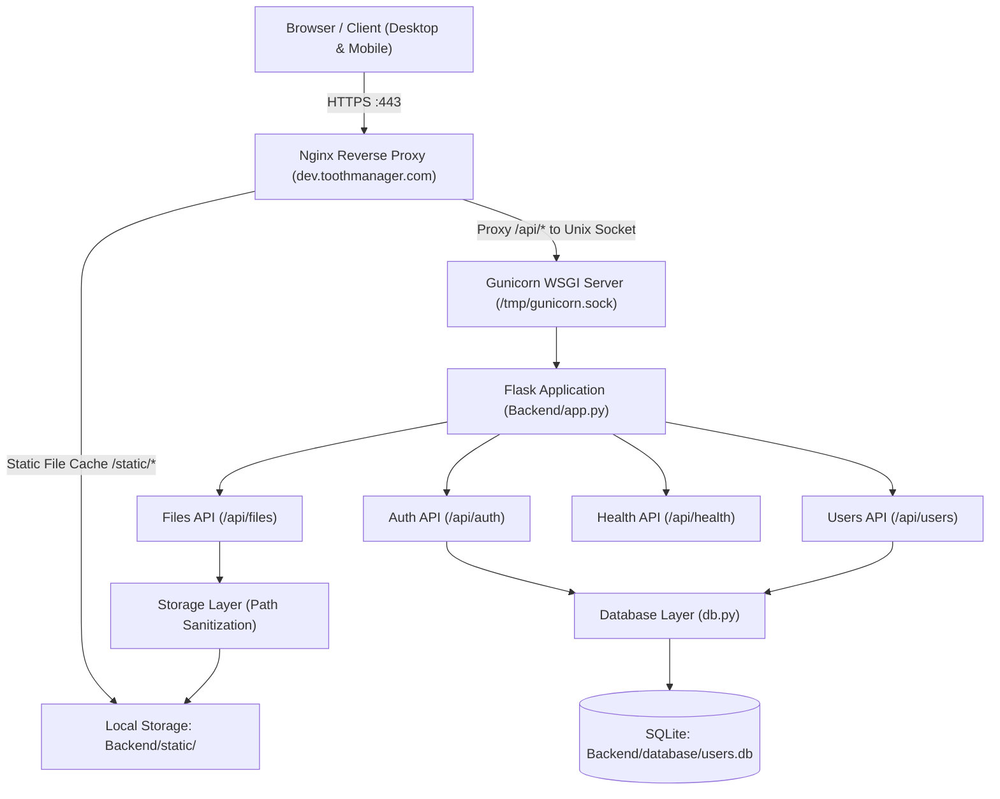

# Tooth Manager - Architecture & Storage Guide

## System Overview

Tooth Manager is a dental practice document management system designed to provide secure, role-based access to practice documents, administrative files, patient forms, and human resource policies.

The system consists of:
1. **Frontend**: Standalone responsive web client styled with a custom dental theme (Milky Way typography, pastel color palette, glassmorphism, responsive CSS grid).
2. **Backend**: Python Flask RESTful API structured with modular blueprints (`auth`, `files`, `users`, `health`).
3. **Database**: SQLite3 database (`Backend/database/users.db`) with dictionary rows, indexed lookups, and automatic password hash migrations.
4. **Storage Layer**: Server filesystem storage (`Backend/static/`) configured via `secrets.json`, served directly by Nginx in production with path traversal safeguards.



---

## 1. Where Are the Files Saved?

### File System Path
All documents and practice folders reside on the server filesystem at:
```text
/home/stepheng753/FileStorageApp/Backend/static/
```

In the backend codebase, this path is controlled by `Backend/core/config.py`:
- `STORAGE_DIR`: defaults to `static` (relative to the `Backend` directory) or configured via `"STORAGE_DIR"` in `Backend/secrets.json`.

### Directory Structure & Production Content
Folders in the static directory represent practice categories, such as:
- `Backend/static/401k ADP/`
- `Backend/static/CareCredit/`
- `Backend/static/Consent Forms/`
- `Backend/static/Dental Assistants/`
- `Backend/static/Dr. Hoang Licenses/`
- `Backend/static/Human Resources/`
- `Backend/static/Insurance/`
- `Backend/static/OSHA/`
- ...and 40+ additional practice folders.

### Web Serving Mechanism
- **In Production**: Nginx serves requests matching `/static/` directly from disk with extreme speed and zero Gunicorn overhead:
  ```nginx
  location /static/ {
      alias /home/stepheng753/FileStorageApp/Backend/static/;
      try_files $uri $uri/ =404;
  }
  ```
- **In Local Development**: Flask serves files under `/static/<path:filename>` directly via `send_from_directory(str(STORAGE_DIR), filename)`.

### Security & Directory Traversal Protection
In legacy versions, uploading or deleting files could be exploited via relative paths (`../../`). The modernized architecture implements `resolve_safe_path()` in `Backend/core/storage.py`:
1. Strips dangerous leading slashes and null bytes.
2. Resolves canonical filesystem paths using `pathlib.Path.resolve()`.
3. Verifies that `os.path.commonpath([target, storage_root]) == storage_root`.
4. Sanitizes filenames with `werkzeug.utils.secure_filename`.

---

## 2. Security & Authentication Architecture

### Authentication Flow (JWT)
1. **Log In**: Client sends credentials (`POST /api/auth/login`).
2. **Verification**: Backend checks password against bcrypt hash. If a legacy plaintext password is encountered, it is automatically migrated to bcrypt.
3. **Token Issuance**: Backend generates a signed JSON Web Token (JWT) using HS256 and `JWT_SECRET_KEY` from `secrets.json`, containing:
   - `sub`: username
   - `user_id`: database primary key
   - `permission_tier`: 1 (Admin), 2 (Staff), or 3 (Pending)
   - `exp`: expiration (24 hours by default)
4. **Authorized Requests**: Client sends `Authorization: Bearer <token>` on all requests.

### Role-Based Access Control (RBAC)

| Tier | Role | Capabilities |
| :--- | :--- | :--- |
| **Tier 1** | **Administrator** (e.g. Dr. Hoang) | • Full document access (Browse, View, Download)<br>• Upload new documents<br>• Create new folders<br>• Delete files and folders<br>• View all user accounts<br>• Approve pending registrations (Change Tier)<br>• Reset user passwords<br>• Delete user accounts |
| **Tier 2** | **Staff Member** | • Browse practice folders<br>• Search documents<br>• View and download files<br>• Cannot upload, delete, or manage users |
| **Tier 3** | **Pending Approval** | • Newly registered accounts<br>• Cannot access any documents or patient files<br>• Displays pending authorization notice |

---

## 3. Database Schema

The database is managed by SQLite3 at `Backend/database/users.db`:

```sql
CREATE TABLE IF NOT EXISTS users (
    id INTEGER PRIMARY KEY AUTOINCREMENT NOT NULL,
    firstname TEXT NOT NULL,
    lastname TEXT NOT NULL,
    username TEXT UNIQUE NOT NULL,
    password TEXT NOT NULL,                -- bcrypt hash ($2b$12$...)
    permission_tier INTEGER NOT NULL DEFAULT 3, -- 1=Admin, 2=Staff, 3=Pending
    created_at TIMESTAMP DEFAULT CURRENT_TIMESTAMP NOT NULL
);

CREATE INDEX IF NOT EXISTS idx_users_username ON users (username);
```
